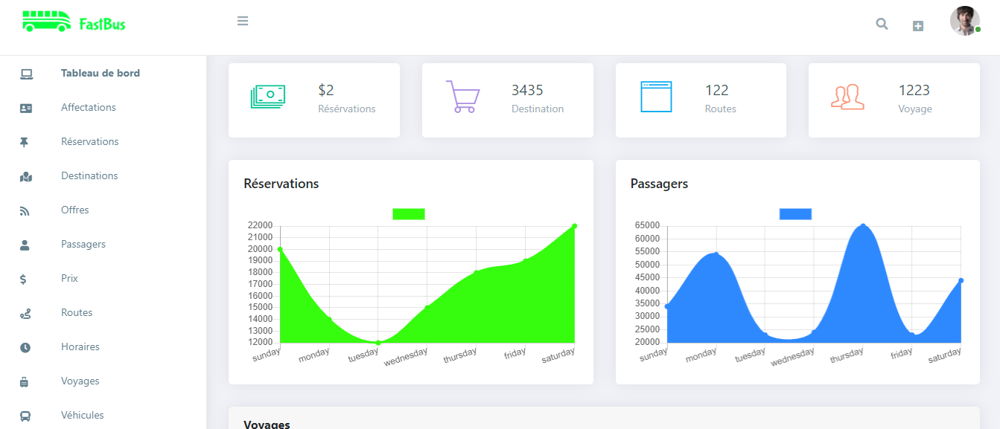

## Introduction

Fast bus is a web application for managing reservations and online sales of seats on buses .

## Informations
-   Status: under development
-   Lastest version 1.0
-   Sector: transport
-   Created: October 2020
-   Last updated: October 2020

## Table of contents
* [Documentation](#general-info)
* [Demo](#demo)
* [Screenshots](#screenshots)
* [Technologies](#technologies)
* [Setup](#setup)
* [Features](#features)
* [Status](#status)
* [Contact](#contact)
* [License](#license)

## Documentation
https://github.com/aniskchaou/FASTBUS-FRONTEND-ADMIN/wiki

## Demo
https://fast-bus.herokuapp.com/

## Screenshots

## Technologies
* Spring boot
* React.js
* Node.js

## Setup

## Features
 -  Manage reservations
-   Manage inventory and programming operations
-   Manage staff
-   Manage buses and shuttles
-   Manage traveler reservations
-   Manage dynamic routing of buses and assign the routes of each
-   Manage the sales and ticketing department

  

## Contact
contact@delta-dev-software.com

## License
<a href="license.txt">MIT License</a>
